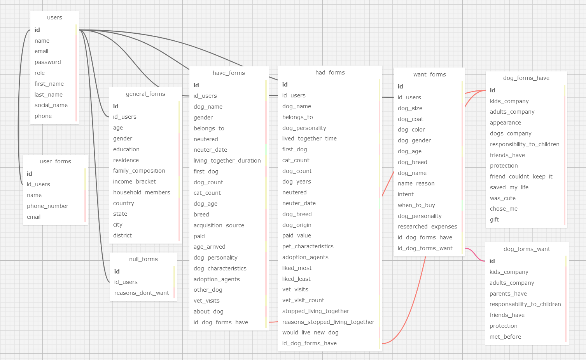

# Modelo Relacional - Ponderada de Programação

**Projeto:** Abandono Zero

**Data:** 2024-05-11

**Autor:** Júlia Lika Ishikawa

**Objetivo:** Descrever o modelo relacional do projeto de forma resumida e simplificada.

## Introdução
&nbsp;&nbsp;&nbsp;&nbsp;A modelagem de banco de dados é o processo de criar uma representação visual e estrutural de um banco de dados. Ela envolve a definição das tabelas que compõem o banco de dados, os campos em cada tabela e as relações entre as tabelas. Existem dois tipos principais de modelagem de banco de dados:

&nbsp;&nbsp;&nbsp;&nbsp;**Modelagem Conceitual:** Nesta fase, o foco está na identificação das entidades principais do sistema, seus atributos e os relacionamentos entre elas. O modelo conceitual é independente do sistema de gerenciamento de banco de dados (SGBD) e é geralmente representado por diagramas de entidade-relacionamento (ER).

&nbsp;&nbsp;&nbsp;&nbsp;**Modelagem Lógica:** Nesta fase, o modelo conceitual é convertido em um modelo lógico, onde as entidades são transformadas em tabelas, os atributos em colunas e os relacionamentos em chaves estrangeiras. O modelo lógico é mais próximo da implementação física do banco de dados e geralmente é representado por diagramas de modelo relacional.

 

## Entidades
&nbsp;&nbsp;&nbsp;&nbsp;Este esquema de banco de dados foi projetado para armazenar informações detalhadas sobre usuários e seus relacionamentos com cães, permitindo análises abrangentes sobre posse, desejos e experiências passadas com cães. Os relacionamentos entre as tabelas são estabelecidos por meio de chaves estrangeiras, garantindo integridade referencial e facilitando consultas complexas sobre os dados.
  - **Usuários** (`users`): Armazena informações básicas sobre os usuários:
    - **id (Chave Primária):** Identificador único para cada usuário.
    - **name:** Nome do usuário.
    - **email:** Endereço de e-mail do usuário.
    - **password:** Senha do usuário.
    - **role:** Papel ou função do usuário no sistema (por exemplo, admin, usuário regular).
    - **first_name:** Primeiro nome do usuário.
    - **last_name:** Sobrenome do usuário.
    - **social_name:** Nome social do usuário.
    - **phone:** Número de telefone do usuário.
 

- **Formulários**
  - **Geral** (`general_forms`): Detalhes gerais do usuário (renda, moradia, etc.).
    - **id (Chave Primária):** Identificador único para cada registro de formulário geral.
    - **id_users (Chave Estrangeira):** Referência ao ID do usuário na tabela users.
    - **age:** Idade do usuário.
    - **gender:** Gênero do usuário.
    - **education:** Nível de educação do usuário.
    - **residence:** Tipo de residência do usuário.
    - **family_composition:** Composição familiar do usuário.
    - **income_bracket:** Faixa de renda do usuário.
    - **household_members:** Número de membros na família do usuário.
    - **country:** País de residência do usuário.
    - **state:** Estado de residência do usuário.
    - **city:** Cidade de residência do usuário.
    - **district:** Bairro de residência do usuário.
   

  - **Possuir Cão** (`have_forms`): Informações sobre o cão que o usuário possui (raça, idade, etc.).
    - **id (Chave Primária):** Identificador único para cada registro de formulário de posse de cão.
    - **id_users (Chave Estrangeira):** Referência ao ID do usuário na tabela users.
    - **dog_name:** Nome do cão.
    - **gender:** Gênero do cão.
    - **belongs_to:** A quem o cão pertence.
    - **neutered:** Indica se o cão foi castrado (sim/não).
    - **neuter_date:** Data da castração do cão.
    - **living_together_duration:** Tempo de convivência com o cão.
    - **first_dog:** Indica se este é o primeiro cão do usuário (sim/não).
    - **dog_count:** Número total de cães que o usuário possui.
    - **cat_count:** Número total de gatos que o usuário possui.
    - **dog_age:** Idade do cão.
    - **breed:** Raça do cão.
    - **acquisition_source:** Fonte de aquisição do cão.
    - **paid:** Indica se o usuário pagou pelo cão (sim/não).
    - **age_arrived:** Idade em que o cão chegou à família.
    - **dog_personality:** Personalidade do cão.
    - **dog_characteristics:** Características do cão.
    - **adoption_agents:** Agentes de adoção envolvidos na adoção do cão.
    - **other_dog:** Outras informações sobre o cão.
    - **vet_visits:** Número de visitas ao veterinário para o cão.
    - **about_dog:** Informações adicionais sobre o cão.
    - **id_dog_forms_have:** Chave estrangeira
   

  - **Já Teve Cão** (`had_forms`): Informações sobre o cão que o usuário já teve (nome, personalidade, etc.).
    - **id (Chave Primária):** Identificador único para cada registro de formulário de posse anterior de cão.
    - **id_users (Chave Estrangeira):** Referência ao ID do usuário na tabela users.
    - **dog_name:** Nome do cão.
    - **belongs_to:** A quem o cão pertencia anteriormente.
    - **dog_personality:** Personalidade do cão.
    - **lived_together_time:** Tempo de convivência com o cão anteriormente.
    - **first_dog:** Indica se este foi o primeiro cão do usuário (sim/não).
    - **cat_count:** Número de gatos que o usuário tinha quando possuía este cão.
    - **dog_count:** Número de cães que o usuário tinha quando possuía este cão.
    - **dog_years:** Idade do cão em anos.
    - **neutered:** Indica se o cão foi castrado (sim/não).
    - **neuter_date:** Data da castração do cão.
    - **dog_breed:** Raça do cão.
    - **dog_origin:** Origem do cão.
    - **paid_value:** Valor pago pelo cão.
    - **pet_characteristics:** Características do animal de estimação.
    - **adoption_agents:** Agentes de adoção envolvidos na adoção do cão.
    - **liked_most:** Aspectos mais apreciados no cão.
    - **liked_least:** Aspectos menos apreciados no cão.
    - **vet_visits:** Indica se houve visitas ao veterinário (sim/não).
    - **vet_visit_count:** Número de visitas ao veterinário para o cão.
    - **stopped_living_together:** Indica se a convivência com o cão foi interrompida (sim/não).
    - **reasons_stopped_living_together:** Motivos para a interrupção da convivência.
    - **would_live_new_dog:** Intenções de conviver com um novo cão.
    - **id_dog_forms_have:** Chave estrangeira
   

  - **Deseja Cão** (`want_forms`): Informações sobre o cão que o usuário deseja ter (tamanho, pelagem, etc.).
    - **id (Chave Primária):** Identificador único para cada registro de formulário de desejo de ter um cão.
    - **id_users (Chave Estrangeira):** Referência ao ID do usuário na tabela users.
    - **dog_size:** Tamanho desejado do cão.
    - **dog_coat:** Tipo de pelagem desejado do cão.
    - **dog_color:** Cor desejada do cão.
    - **dog_gender:** Gênero desejado do cão.
    - **dog_age:** Idade desejada do cão.
    - **dog_breed:** Raça desejada do cão.
    - **dog_name:** Nome desejado para o cão.
    - **name_reason:** Motivo para a escolha do nome do cão.
    - **intent:** Intenção de compra ou adoção.
    - **when_to_buy:** Quando planeja obter o cachorro.
    - **dog_personality:** Personalidade desejada do cachorro.
    - **researched_expenses:** Despesas pesquisadas relacionadas ao cachorro.
    - **id_dog_forms_have:** Chave estrangeira
    - **id_dog_forms_want:** Chave estrangeira
   
  - **Sem Cão** (`null_forms`): Motivo pelo qual o usuário não tem e não deseja ter um cão.
    - **id (Chave Primária):** Identificador único para cada registro de formulário nulo.
    - **id_users (Chave Estrangeira):** Referência ao ID do usuário na tabela users.
    - **reasons_dont_want:** Motivo pelo qual o usuário não deseja ter um cão.
 

- **Contato** (`user_forms`): Dados para contato futuro com o usuário (nome completo, celular, email).
-  **id:** Um identificador único para cada registro na tabela, provavelmente um número inteiro autoincrementado.
    - **id_users:** Uma chave estrangeira que se relaciona com a coluna id da tabela users, indicando a qual usuário o formulário pertence.
    - **name:** Uma coluna que armazena o nome do usuário.
    - **phone_number:** Uma coluna que armazena o número de telefone do usuário.
    - **email:** Uma coluna que armazena o endereço de e-mail do usuário.
 

- **Cão (Possuir)** (`dog_forms_have`): Informações extras sobre o cão que o usuário possui (nome, gênero, castrado, etc.).
    - **id:** Identificador único para cada registro na tabela.
    - **kids_company:** Se o cão faz companhia para crianças.
    - **adults_company:** Se o cão faz companhia para adultos.
    - **appearance:** Aparência do cão.
    - **dogs_company:** Se o cão faz companhia para outros cães.
    - **responsibility_to_children:** Nível de responsabilidade em relação às crianças.
    - **friends_have:** Se os amigos têm cães.
    - **protection:** Se o cão oferece proteção.
    - **friend_couldnt_keep_it:** Se um amigo não pôde manter o cão.
    - **saved_my_life:** Se o cão salvou a vida do dono.
    - **was_cute:** Se o cão era fofo.
    - **chose_me:** Se o cão escolheu o dono.
    - **gift:** Se o cão foi um presente.
 

- **Cão (Desejar)** (`dog_forms_want`): Informações extras sobre o cão que o usuário deseja ter (tamanho, pelagem, cor, etc.).
  - **kids_company:** Se o cão faz companhia para crianças.
  - **adults_company:** Se o cão faz companhia para adultos. 
  - **parents_have:** Se os pais já tiveram/têm.
  - **responsibility_to_children:** Nível de responsabilidade em relação às crianças.
  - **friend_have:** Se amigos têm.
  - **protection:** Se o cão oferece proteção.
  - **met_before:** Se o tutor já tinha conhecido o cão antes.

 

## Relacionamentos

- Um usuário pode ter um único formulário geral (1:1).
- Um usuário pode ter vários formulários de cães (N:N).
- Um formulário de "possuir cão" pode ter um único registro de "cão (possuir)".
- Um formulário de "desejar cão" pode ter um único registro de "cão (desejar)".

&nbsp;&nbsp;&nbsp;&nbsp;Partindo dos princípios supracitados, os seguintes relacionamentos foram estabelecidos entre as entidades:

- **users (id):** A tabela `users` armazena informações sobre os usuários do sistema, onde o campo id é a chave primária, garantindo a unicidade de cada usuário.
 

- **user_forms (id_users):** A tabela `user_forms` está relacionada à tabela `users` através do campo `id_users`, que é uma chave estrangeira. Cada registro em `user_forms` está associado a um único usuário na tabela `users`.
 

- **general_forms (id_users):** A cardinalidade desse relacionamento é um para um (1:1) porque cada usuário preenche exatamente uma `general_forms` e cada `general_forms` é preenchida por exatamente um usuário.
 

- **have_forms (id_users):** A cardinalidade do relacionamento entre `have_forms` e `users` é um para muitos (1:N), pois cada usuário pode possuir um ou mais cachorros, e cada registro na tabela `have_forms` está vinculado a exatamente um usuário.
  Já a  cardinalidade do relacionamento entre `have_forms` e `dog_forms_have` é um para um (1:1), pois cada entrada em `have_forms` está vinculada a exatamente uma entrada em `dog_forms_have`, e vice-versa.
 

- **had_forms (id_users):** A cardinalidade do relacionamento entre `had_forms` e `users` é um para muitos (1:N), pois cada usuário pode ter um ou mais cachorros, e cada registro de cachorro está vinculado a exatamente um usuário.

  A cardinalidade do relacionamento entre `had_forms` e `dog_forms_have` é um para um (1:1), pois cada registro de cachorro em `had_forms` está vinculado a uma única razão na tabela `dog_forms_have`, e vice-versa.
 

- **want_forms (id_users):** A cardinalidade do relacionamento entre `want_forms` e `users` é um para muitos (1:N), pois cada usuário pode preencher múltiplas preferências sobre o tipo de cachorro que deseja, e cada registro na tabela `want_forms` está associado a exatamente um usuário.
 

- **null_forms (id_users):** A cardinalidade do relacionamento entre `null_forms` e `users` é um para muitos (1:N), pois cada usuário pode preencher várias razões para não querer um cachorro, e cada entrada na tabela `null_forms` está vinculada a exatamente um usuário.

 

## Regras de Negócio

- Todos os campos obrigatórios devem ser preenchidos.
- As informações devem ser consistentes entre os formulários.
- Os usuários não podem editar informações já salvas, exceto em casos específicos.
- As informações dos usuários são confidenciais.

## Diagrama
&nbsp;&nbsp;&nbsp;&nbsp;Utilizando o software <a href="https://sql.toad.cz/">SQL Designer</a>, foi possível realizar a seguinte modelagem:

Figura 1 - Modelo Relacional

Fonte:  Material produzido pelo autor (2024) 

 
&nbsp;&nbsp;&nbsp;&nbsp;Esse modelo relacional pode ser gerado por meio do código em sql, para acessar [clique aqui](modelagemRelacional.xml)

 

## Considerações Finais

&nbsp;&nbsp;&nbsp;&nbsp;Este modelo relacional simplificado fornece uma base para o gerenciamento eficiente das informações dos usuários e suas respostas nos formulários do projeto Abandono Zero. As entidades, seus atributos e relacionamentos garantem a organização e a integridade dos dados. As regras de negócio garantem a consistência e a confiabilidade das informações.